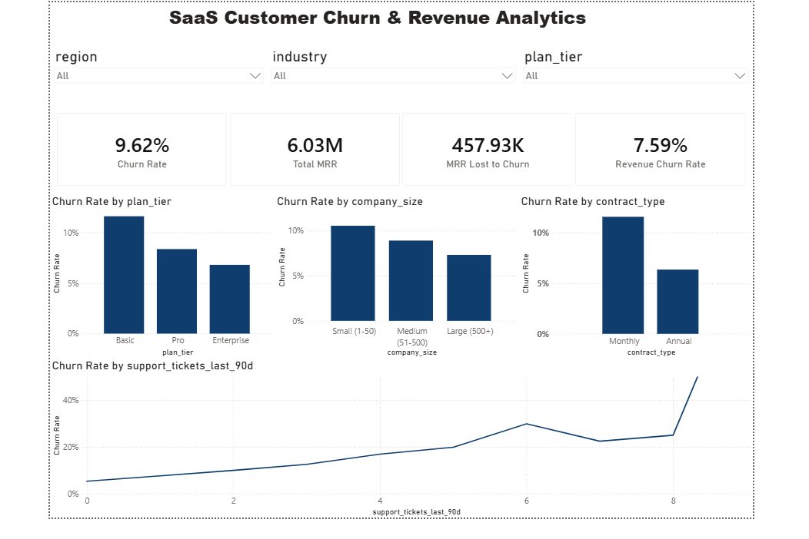

# SaaS Customer Churn & Revenue Analytics

A business analytics project analyzing customer churn and revenue impact for a subscription SaaS business — from raw data to a business-ready Power BI dashboard.

## Business Problem

A subscription SaaS company has noticed revenue growth slowing and wants to understand: are we losing customers, and if so, why — and how much is it costing us?

This project answers:
1. What is the overall churn rate, and how does it vary across segments?
2. Which customer segments churn the most?
3. What early-warning signals predict churn before it happens?
4. How much monthly recurring revenue (MRR) is lost to churn?
5. What should the business do to reduce it?

## Dataset

26,000 synthetic SaaS customer records (snapshot date: June 30, 2026), built to reflect realistic SaaS churn behavior — churn probability is influenced by product usage, support activity, billing type, plan tier, company size, and customer tenure. See `data/data_dictionary.md` for full column definitions.

> Synthetic data was used since real customer-level churn data is confidential. Patterns are modeled on realistic SaaS churn behavior, not randomly generated.

## Project Workflow

1. **Business Understanding** — defined the business questions, objectives, and stakeholders
2. **Data Cleaning & Validation** — checked for nulls, duplicates, and logical errors in Excel; found and fixed 311 records with missing churn dates (`docs/data_cleaning_process.md`)
3. **Exploratory Data Analysis (Python)** — used pandas and matplotlib to visualize churn patterns across segments and behaviors
4. **KPI Framework** — defined the metrics a retention team would track (churn rate, revenue churn, at-risk customer count)
5. **Power BI Dashboard** — built an interactive, filterable dashboard for non-technical stakeholders
6. **Insights & Recommendations** — translated findings into prioritized business actions

## Key Findings

| Metric | Value |
|---|---|
| Overall churn rate | 9.62% |
| Total MRR | $6,032,191 |
| MRR lost to churn | $457,926 (7.59%) |
| Highest-risk segment | Basic plan, Monthly billing, Small companies |
| Strongest churn driver | Feature adoption (low usage = 18.8% churn vs 1.73% for high usage) |
| At-risk active customers identified | 647 customers ($147,193/month exposure) |
| Avg tenure — churned vs active | 7.5 months vs 15.7 months |

## Recommendations

1. **Build a 90-day onboarding program** — churn risk is highest early in the customer lifecycle
2. **Trigger usage-based alerts** — low feature adoption is the strongest predictor of churn; catch it before it leads to cancellation
3. **Incentivize Annual billing** — Monthly customers churn at nearly 2x the rate of Annual customers
4. **Activate the at-risk customer list** — 647 active customers ($147K/month) are showing warning signs today and can be proactively contacted
5. **Investigate support ticket root causes** — rising ticket volume may signal product friction, not just support quality

Full write-up: `docs/insights_and_recommendations.md`

## Dashboard



Interactive filters by region, industry, and plan tier. Built in Power BI.

## Tools Used

- **Excel** — data cleaning and validation (nulls, duplicates, logical error checks)
- **Python** (pandas, matplotlib) — exploratory data analysis
- **Power BI** (Power Query, DAX) — interactive dashboard and KPI visualization

## Repository Structure

```
├── data/            → dataset + data dictionary
├── python/          → EDA script
├── charts/          → EDA chart images
├── dashboard/        → Power BI file + screenshot
└── docs/            → data cleaning process + insights & recommendations write-up
```

## Info
Gaurav — www.linkedin.com/in/gaurav-insights — gouravchauhan449@gmail.com
